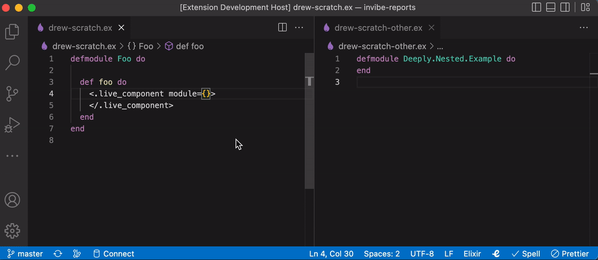
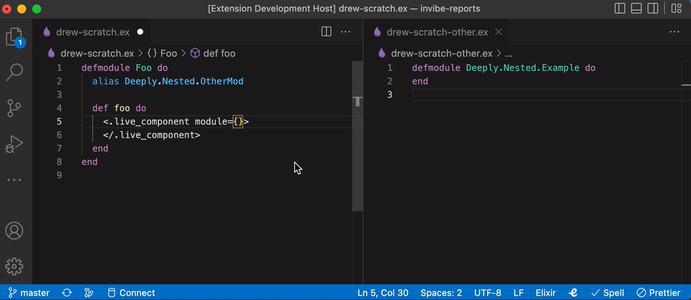

# elixir-auto-alias README

This extension will hopefully auto-alias modules in your elixir project.

## Features

If you type the name of a module in your project, you'll see an autocorrect option that lets you add an alias for that module.

If you've already aliased a parent of the module, the new alias will be added.

